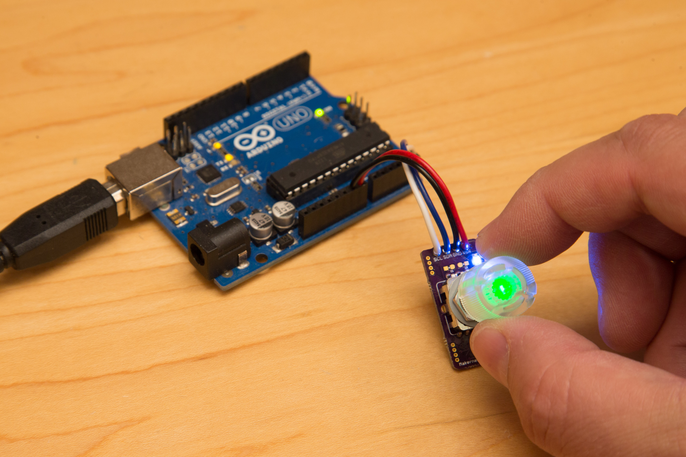
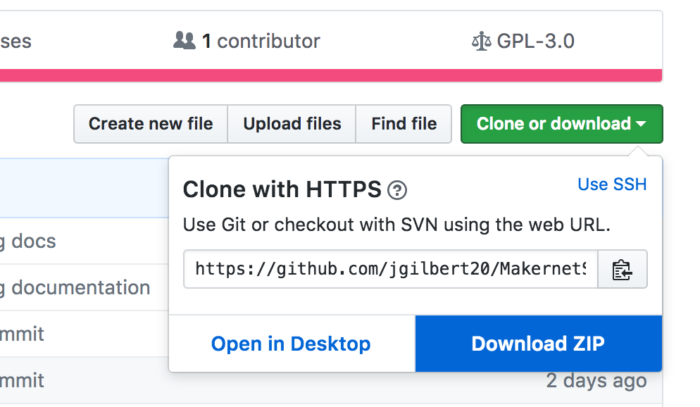

# MakernetSimple Knob (GM1200PTH)

## TL;DR

Problem: Rotary encoders are cool but hard to wire into your projects

Solution: Makernet Knob puts a rotary encoder with RGB backlighting into your project as intuitive daisy-chainable I2C device

Mischief managed!

## What is it? (Rotary encoders are cool but hard)

Ever played with an "infinite" knobs on your car radio that keep spinning in either direction? These special knobs are a form of "rotary encoder", a device that translates the rotational movement of your fingers into a series of digital special pulses. Rotary encoders are super-cool and add a bit of pizzaz to any project. They make for a great tactile experience far better than up/down buttons or joysticks. 

I think every project deserves a rotary encoder and I've used them in many of my own creations.

Sadly, rotary encoders are not simple to use. In fact, they can be downright complicated. You have to stick them on special interrupt pins and tweak and tune the libraries and capacitors just right to get good results. And adding more than one dial to a single project can be an complex chore that could potentially involve logic probes and interrupt remapping. Yuck!

Well, hackers of the world, suffer no longer! The Makernet Knob takes the infinite twirling goodness of a traditional rotary encoder (with its complex pulse train) and provides you with a dead-simple, daisy-chainable I2C interface. For those new to the scene, I2C is a simple and easy-to-use bus that you almost certainly already have on your maker boards. In fact, nearly every microprocessor from the Raspberry Pi, ESP8266, AVR/Arduino, and even the popular Teensy boards supports I2C. With the Makernet Knob, you just connect up four simple wires and suddenly a beautiful encoder with a controllable RGB LED and pressable-select button can join your project with a minimum of fuss.

## Features

Special features of the Makernet Encoder:

* Uses plain old I2C available on any microprocessor; no special pins, interrupts or real-time code needed
* Pre-made libraries and test code with plenty of examples
* Tested with Arduino, Teensy and Raspberry Pi
* Put literally hundreds of knobs into your project without any extra hassle
* Transparently compatible with 5V and 3.3V logic, with built-in "level shifting"
* Includes internal pull-up resistors 
* The encoder is made of a transparent shaft that can be lit via three PWM channels to any desired RGB value
* Pressing the encoder triggers a switch which can be used to select items or trigger any other action
* All of the logic to de-noise and de-scale a rotary encoder is done for you - you just make a few simple library calls in your sketch
* Easy to mount in a project using a XXXX mm drill hole
* Extra compact PCB
* Contains special code that lets you set it to any I2C device address allowing you to daisy chain and avoid I2C address conflicts
* Built by a Maker just like you!

## Where to use it

Some cool project ideas for a rotary encoder you might want to try:

* Use it in place of a regular potentiometer knob for more precise  and fun control of a counter or project setting
* Give your computer a volume knob that is fun to click and use (using an Arduino that emulates USB keyboard keypresses)
* Implement a Left-Right-Left safe that only unlocks when the right numbers are selected
* Give your next clock project a super cool way to set a timer or alarm
* Build your own midi control surface!

## Its dead simple

The Makernet Encoder has only four pins: VIN (3.3-10V), GND, SDA and SCL. A tiny (and super inexpensive) microprocessor is integrated on the board and takes care of all of the rest. Be sure to install the Arduino IDE library and check out the various examples below for more details.

## Why did you make it?

I love building cool interactive projects and have frequently suffered the royal pain of integrating rotary encoders. I've resolved from this day forward no one else should have to go through that pain again!

## Basic hardware instructions

The hardware for the Makernet Encoder comes with a small voltage regulator, LED drivers, level-shifting logic to support both 3.3 and 5V projects, and an extra status LED. Simply connect the VIN pin to your project's 5V or 3.3V power rail, and GND to the project ground. SDA and SCL are connected to the proper pins on your microcontroller just like a sensor or any other I2C device. 

Here is an example connected to an Arduino UNO, but the basic wiring is essentially the same for any microcontroler board.

* Connect VIN from the Knob to the 5V pin of the Uno
* Connect GND to GND
* Connect SDA from the Knob to the pin A4
* Connect SCL from the Knob to the pin A5 on the Uno

The blue light on the Makernet Knob should light up, indicating that its receiving power. (Don't worry, you can turn off this LED in your sketch if you don't like it.)

## Basic software examples

Once you have the hardware set up, you'll need to install the right software libraries. This will provide you with the software support for the library, the documentation and some great examples to try.

First, install the MakernetSimple library into your Arduino programming environment. To do this, download the entire repository as a .ZIP file using this green link above. 

Next, follow the instructions [here](https://www.arduino.cc/en/Guide/Libraries) to install into the library into your Arduino IDE. Another great source of help is [Adafruit's "All about Arduino Libraries."](https://learn.adafruit.com/adafruit-all-about-arduino-libraries-install-use/arduino-libraries)

Inside you'll find several example sketches. 

First, lets get your hello world up and running:

## The software API

Communicating with the Makernet Knob is really simple

## Advanced hardware details

Under the hood, the Makernet Encoder is powered by an Atmel ATSAMD11D14. This is a 48-Mhrz ARM Cortex-M0 processor that is equally as powerful as many of the development boards commonly used by embedded engineers and tinkerers. This chip is unique for its exceptionally low cost, low power consumption, and entirely internal clock which obviates the need for an external crystal. In fact if it weren't for the need to level-shift, this board would have less than 7 discrete components!

When you look at the PCB board itself, you will no doubt notice that there are a few components that have not been populated. There is no need to worry about these "missing" components. On the front side of the board, there are spaces for two 0603 capacitors you could potentially use for hardware debouncing. These capacitors are left unpopulated since the board has a hardened debouncing algorithm implemented in software that will give you rock-solid results out of the box. If you should choose to populate these capacitors for any reason, you should consider using 10nf caps. Through experimentation, I've learned this is ideal capacitance if you don't want so squelch signals from rapid turns.

On the back of the board you may find a few additional unpopulated components I should tell you about here:

These spots are used for an entirely-optional 32 KHz external crystal, Digikey part number XXX, and two 22pF trimming capactitors. No external crystal is actually needed in normal operation so this is really not something you will ever need to bother about. Why not? The SAMD11 has an internal "Phase-Locked Loop" that drives a very stable clock signal from its own internal factory-calibrated RC clock circuit. This internally-generated clock signal appears to be stable enough to support I2C speeds of 4Mbs, and serial communication as high as 230,000 baud. There should be no reason for any casual user to ever have to add an external crystal - the empty space is there for future unanticipated purposes.

These boards also include a small "micro-header" which advanced users can use for experimentation or expansion. Using these pins you can reprogram the board to support new behaviors or features. The micro header on the side closest to the main header includes a serial connection (Tx/RX) and a reset pin. And the micro header on the opposite side contains SWD and SWC pins, which let you use any compatible JTAG programmer (like the Segger J-Link) to load your own firmware. 

Reprograming the board itself is not needed for most casual users but an advanced hacker may want to experiment with writing their own encoder firmware. I don't officially support this but I feel that every open-source maker tool ought to offer this as an option. Naturally, all of this reprograming can be done using open source software you can download to your computer under a free license. To write code for the board, you must download (and slightly modify) the MattairTech SAMD11 Arduino Core ported by Justin Mattair. All of your actual firmware code can be written in the Arduino IDE itself, which is what I personally use for development. The only major hassle is that you must upload the code using the JTAG/SWO interface rather than using a serial port or USB. 

To do this upload, first you will need to compile your sketch with settings for the board. Select a SAMD11D14 Generic as the board type. Also, don't forget to skip the bootloader (`NO_BOOTLOADER`), select the internal oscillator as a clock source (`INTERNAL_OSCILATOR`), and disable the USB peripherals in the Tools menu (`USB_DISABLED`). The PCB does not break out the USB DP/DM pins. Note that in this configuration, Serial and Serial1 are mapped to hardware serial ports. 

The exact process for uploading new code to the Makernet Encoder is a little outside of the scope of this tutorial (and also not officially supported) but basically involves the following:

1) Make sure your device is powered and the SWD and SWC pins are connected to your programmer. (The reset pin is almost never needed unless you royally screw something up, so I usually leave it disconnected.)
2) Select ATSAMD11D14 in your programmer. For instance, if using JLink, use `JLinkExe -if SWD -device ATSAMD11D14 -speed auto -autoconnect 1`
3) Generate a .BIN file using your IDE of choice. If using the Arduino IDE you can select "Export compiled binary" and find the .bin file in your sketch's main directory
4) Tell your programmer to load the .BIN file and issue a reset
5) Viola!

If you are seriously contemplating modifying the default firmware, you should consider buying a SAMD11D14 breakout board from MattairTech for prototyping your code. Not only will this give you far more wiggle room and safety-margin to experiment, but your dollars will go to help Justin support the SAMD11 Arduino Core.

